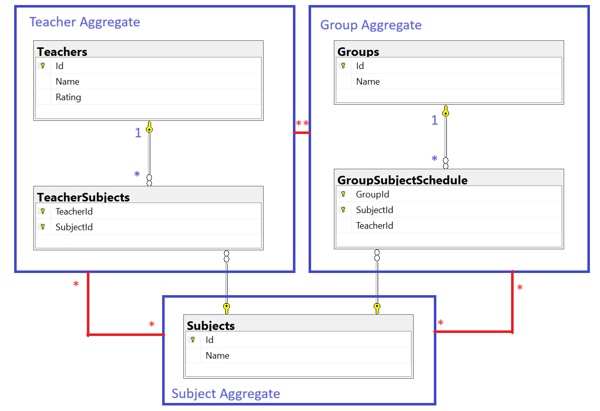

# Процесс декомпозиции

В [Lesson4-2.sql](Lesson4-2.sql) приведен скрипт, выполняющий пошаговую нормализацию исходной таблицы. В процессе декомпозиции обнаруживается, что в ее состав входило аж 3 сущности - учитель `Teacher`, группа `Group` и, тяжело определяемая на первый взгляд, преподаваемая дисциплина (`Subject`).

# Разбор результирующих связей

## Связь Один-к-Одному

**Один-к-Одному** на схеме не представлена, т.к. мы не испытываем избытка сценариев использования этих таблиц. В такой ситуации нет смысла разделять состояние какой(их)-либо из таблиц, пока мы не можем дать никакого осмысленного названия некоей группе сценариев. Такие группы мы зовем фичами (Feature, на русский ближе всего - свойство/функционал). В том числе это очень мощный инструмент оптимизации использования как дисковой, так и оперативной памяти SQL Server-ом, осведомленность о котором среди разработчиков оставляет желать лучшего.

## Связь Один-ко-Многому

**Один-ко-Многому** полноправно присутсвует между `Teachers` и `TeacherSubjects`, а также между `Groups` и `GroupSubjectSchedule`. *Много* может помечаться двумя способами на схемах: астериском (`*`) или диапазоном (`1..N`).

## Связь Много-ко-Многому

### Отсутсвует исходя из доменной модели

Если говорить серьезно, **Много-ко-Многому** отсутсвует на схеме. В парадигме DDD (Проектированию по Предметной Области или Domain Driven Design, автор Эрих Эванс), выделяют группы таблиц, доступ к которым всегда выполняется через корневую таблицу, другими словами - "сущность" (обычно всегда с `IDENTITY PRIMARY KEY`). Транзактивные связи между таблицами рассматриваются только внутри агрегата, только изредка прибегая к связыванию двух или более агрегатов и сопутсвующему определению, кто из них будет выполняет роль "корневого агрегата". 

`Subject` не может стать частью ни `Teacher` ни `Group` агрегатов, так как они равноправны. Если же допустить добавление в оба сразу - это приведет к повышению вероятности несогласованности БД и/или взаимоблокировок, такие связи сложно поддерживать на уровне доменной модели, чтобы не "оступиться".

Напротив, `Subject` не может стать и корневым агрегатом для этих двух, в силу большого различия в их "мощности". То есть сущностей учителей и групп гораздо больше, чем сущностей преподаваемых дисциплин, поэтому агрегат `Subject`, не смог бы оперировать этими коллекциями как единым целым при необходимости (типа загружать список целиком, одним запросом).

### Присутствует исходя из теории баз данных

Если же подходить чисто с теории баз данных, то связи **Много-ко-Многому** в текущей схеме все же присутсвуют. Классическим примером выступает связь между `Teachers` и `Subjects`, где связующая таблица `TeacherSubjects` не содержит никаких дополнительных атрибутов, кроме ключевых. Неклассическим примером можно рассматривать и связь между `Groups` и `Subjects`, опосредованную созданием расписания занятий с назначением на него учителя и, потенциально, оперирующими и другими атрибутами, которые были упомянуты в скриптах, но опущены для простоты.

Связи между далеко расположенными таблицами, как между `Groups` и `Subjects`, принято просто называть транзитивными (или реже непрямыми) и никак не категоризировать. Но нам ничто не мешает абстрагироваться и назвать такую связь тоже "много-ко-многому", оговорившись при этом о транзитивности - лишь бы собеседник понял.

### Какие коррективы вносит поклонение микросервисам

Учитывая текущую тенденцию к овергранулярности (избыточной декомпозиции систем на компоненты), можно говорить, что каждый транзактивно не связанный/ая с другими агрегат/группа агрегатов, является кандидатом на выделение в отдельную БД (под каким-нибудь микросервисом, аля в отдельном "ограниченном контексте"). Умалчивая о деталях усложнения в развитии и поддержке согласованности таких систем, для нас это будет означать, что наши агрегаты `Teacher`, `Group` и `Subject`, просто утратят возможность устанавливать транзактивные связи, в т.ч. ограничения внешних ключей, которые сейчас обеспечивают согласованность ссылок между ними. 

P.S. Людям привыкшим рисовать такие красивые диаграммки таблиц тоже приходится несладко, когда связанная таблица переезжает в другой сервис.
